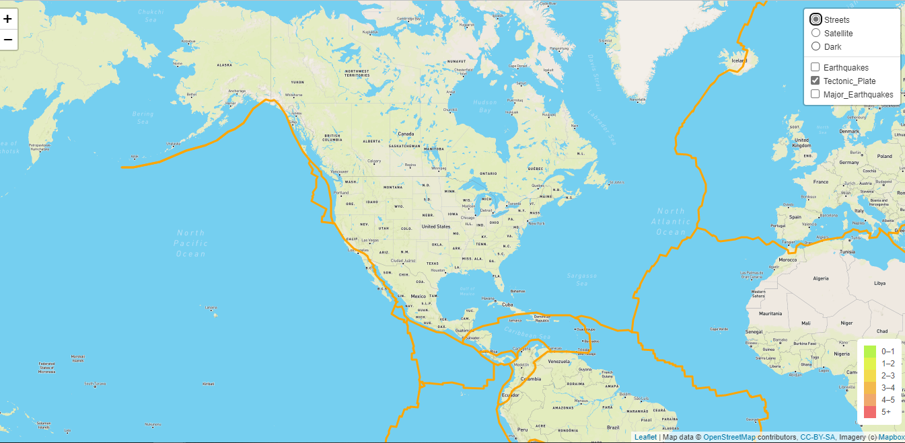
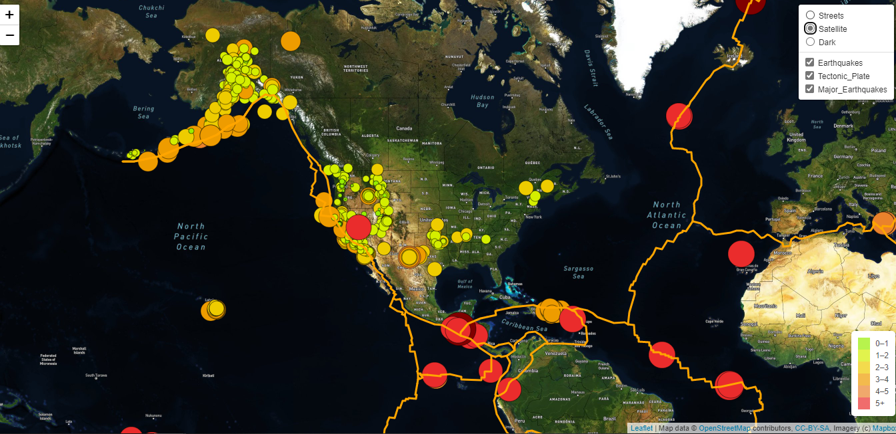

# Mapping_Earthquakes
Mapping_Earthquakes, JavaScript, D3, Geo Json,Leaflet library 

## Project Overview

For this project we are creating an interactive map that shows the latest earthquake activity around the world. Maps allow us to explore, understand and make decisions about our world.

## Purpose
The purpose of this project is to visually show the differences between the magnitudes of earthquakes all over the world for the last seven days.

Approach will be to use the JavaScript and the D3.js library to retrieve the coordinates and magnitudes of the earthquakes from the GeoJSON data. Also use of the Leaflet library to plot the data on a Mapbox map through an API request and create interactivity for the earthquake data.

An interactive world map of earthquakes

## Requirements
 Add Tectonic Plate Data

An interactive world map of earthquakes

 Add Major Earthquake Data

An interactive world map of earthquakes

 Add an Additional Map

An interactive world map of earthquakes

## Resources

**Data Source:**

- GeoJson file for Tectonic Plates retrieved from GitHub repository: https://github.com/fraxen/tectonicplates/tree/master/GeoJSON
- GeoJson file for Earthquakes for the past 7 days retrieved via API call from USGS website: https://earthquake.usgs.gov/earthquakes/feed/v1.0/summary/all_week.geojson
- GeoJson file for Major Earthquakes (M4.5+) for the past 7 days via API call from USGS website: https://earthquake.usgs.gov/earthquakes/feed/v1.0/summary/4.5_week.geojson

- **GeoJson** files that are specifically design to host geographical information. GeoJson files are the industry standard for representing simple geographical features, such as points, linestrings and polygons and non-spatial attributes, such as magnitude of the earthquake, hurricane strength, hail size, elevation, etc.

**Software:**
- Mapbox API [challenge_logic.js](static/js/challenge_logic.js)
    -  An open source mapping platform for custom designed maps. 

- VS Code and Chrome Developer Tools

**Languages:**
- JavaScript, 
- [HTML](index.html) and [CSS](static/css/style.css) 

**Libraries:**
- D3
- Leaflet
    - A JavaScript library, designed to build the web mapping applications.
